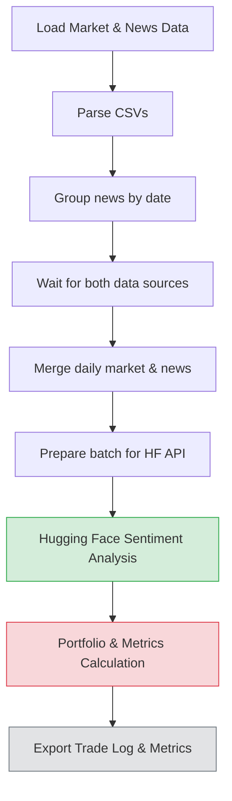

# Crypto Trading Bot - Simple Batch Fixed

## 👥 Team Members
- Vladimir Nosov
- Myagdeev Ruslan
- Kirillova Anastasia
- Pavel Manuilov

## 🧠 Strategy Overview

### Core Logic
This strategy is a **hybrid sentiment + technical indicators system** for crypto trading.  
It uses market data, news sentiment, and technical indicators (RSI, Bollinger Bands, MACD) to generate buy/sell signals in a batch mode.

**Key principles:**
- **Batch sentiment analysis:** News headlines are aggregated daily and fed into a Hugging Face NLP model (`distilbert-base-uncased-finetuned-sst-2-english`) to score market sentiment.
- **Signal generation:** Trades are determined using sentiment + technical indicators:
  - **Bullish conditions:** Strong positive sentiment (`score > 0.7`), RSI < 40 (oversold), lower BB position < 0.3, MACD histogram > -5.
  - **Bearish conditions:** Strong negative sentiment (`score > 0.7`), RSI > 60 (overbought), upper BB position > 0.7.
- **Aggressive trading:** Every signal triggers either a **buy or sell**; no hold signals.
- **Portfolio tracking:** Each asset starts with equal allocation, PnL is calculated on exit, and mark-to-market is updated daily.
- **Metrics:** Calculates Sharpe ratio, total return, max drawdown, win rate, and profit factor for portfolio performance analysis.

### Decision Flowchart (Mermaid)

## Performance Analysis (Backtest)
- Sharpe Ratio: calculated on daily equity curve
- Total Return: % change from initial capital
- Max Drawdown: max peak-to-trough loss
- Win Rate: proportion of profitable trades
- Profit Factor: sum of profits / sum of losses
- 
### Strengths:
- Integrates sentiment with technical indicators.
- Uses batch processing to optimize API calls.
- Provides full portfolio metrics with PnL tracking.

### Limitations:
- Aggressive strategy may overtrade in volatile markets.
- Dependent on quality of news sentiment analysis.
- No risk management rules beyond aggressive exit conditions.
