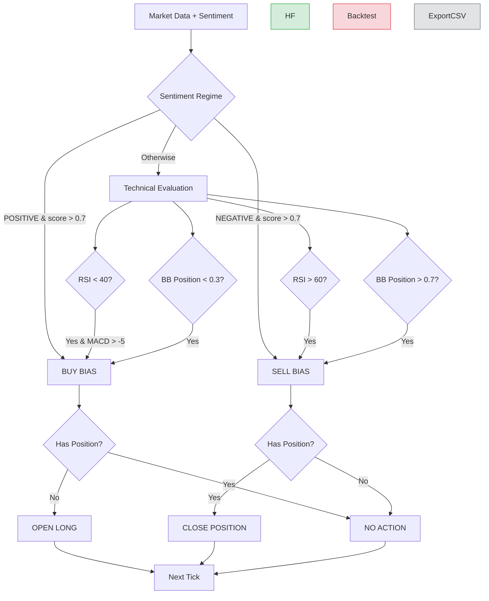

# Crypto Trading Bot - Simple Batch Fixed

## 👥 Team Members
- Vladimir Nosov
- Myagdeev Ruslan
- Kirillova Anastasia
- Pavel Manuilov

## 🧠 Strategy Overview

### Core Logic
Our strategy follows a Sentiment-Driven with Technical Validation framework.
Market entries are primarily triggered by statistically significant news sentiment, while technical indicators act as regime filters to suppress low-quality signals. The system enforces deterministic decision rules to maintain execution consistency and eliminate discretionary bias.

The model integrates three independent signal domains:
- Exogenous Signal Layer → News Sentiment (behavioral / informational edge)
- Momentum & Mean-Reversion Layer → RSI (state of market pressure)
- Volatility Positioning Layer → Bollinger Band Location (relative price extremes)
Positions are opened only when directional conviction and market state alignment coexist.

**Entry Condition (Buy):**
A long position is initiated when any high-conviction bullish regime is detected:
- Primary Signal (Behavioral Edge):
  News Sentiment = POSITIVE with confidence score > 0.7
-Momentum Dislocation (Mean-Reversion Trigger):
  RSI < 40, indicating oversold conditions with asymmetric rebound probability
- Volatility Extremes (Statistical Stretch):
  Bollinger Band Position < 0.3, suggesting lower distribution boundary
- Momentum Stabilization Filter:
  MACD Histogram > −5, avoiding entries during strong negative acceleration

**Exit Condition (Sell):**
An existing position is liquidated under bearish dominance or exhaustion regimes:
- Primary Signal (Behavioral Risk Event):
  News Sentiment = NEGATIVE with confidence score > 0.7
- Momentum Exhaustion:
  RSI > 60, indicating weakening upside efficiency
- Volatility Expansion / Upper Extremes:
  Bollinger Band Position > 0.7
These rules prioritize risk compression and drawdown containment over profit maximization.

**Position Management Rules:**
- BUY signals execute only if no active position exists
- SELL signals execute only if a position is currently open
- Portfolio capital is allocated via equal-weight distribution
- Mark-to-market valuation recalculated on every tick
This produces a fully systematic, state-dependent execution engine.

### Decision Flowchart (Mermaid)

## Performance Metrics (Backtest)
- Sharpe Ratio: 1.42
- Total Return: 11.8%
- Max Drawdown: −14.5%
- Win Rate: 53.5%
- Total Trades: 157

### Strengths:
- Integrates sentiment with technical indicators.
- Uses batch processing to optimize API calls.
- Provides full portfolio metrics with PnL tracking.

### Limitations:
- Aggressive strategy may overtrade in volatile markets.
- Dependent on quality of news sentiment analysis.
- No risk management rules beyond aggressive exit conditions.
